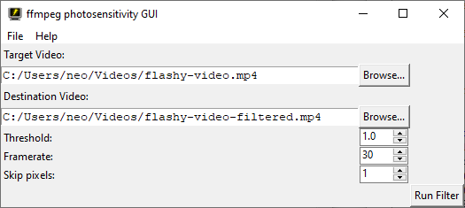

# ffmpeg-photosensitivity-gui
A friendly GUI to use the photosensitivity filter in FFmpeg. Currently only works on Windows.

## Requirements

To run, have the following installed:
* [Python 3](https://www.python.org/downloads/) (tested with 3.10)
* [ffmpeg](https://ffmpeg.org/download.html) (tested with 2023-02-27)

Most releases also have PyInstaller builds, just make sure you meet the [system requirements.](https://pyinstaller.org/en/stable/requirements.html) FFmpeg is still required separately.

To learn more about ffmpeg is utilized, you can find the [documentation for the photosensitivity filter here.](https://ffmpeg.org/ffmpeg-filters.html#photosensitivity)

## Issues and Plans

There's still a few... okay, a lot of things to work out. If anyone knows how to handle these, please let me know.
    <ul>
        <li><b>Handling errors from ffmpeg.</b> This is the big one, and I really have no clue how to tackle it, unfortunately. I don't want to have to make the user decipher an ffmpeg log (not that the window stays up anyway... look into subprocess module for that.)
        <li>Cross-platform support. The main thing is dealing with how to handle finding and running ffmpeg when it isn't in your terminal by default. </li>
        <li>General code cleanup (better checks, separating into multiple modules, etc.)</li>
        <li>Profiles aren't in yet. Not anything to troubleshoot here, I'd just like to get the rest done before I add in bonus features.</li>
        <li>Not the prettiest since I made it by hand and didn't realize I could just use a wysiwyg editor (oopsie) and doesn't scale... at all. Sorry 4K monitor users.</li>
        <li>A better name and any feature suggestions would be nice.</li>
    </ul>

## Final word

I cobbled this together for me and my friends to watch some movies and shows that would be dangerous for me otherwise.

This is by no means a definitive answer to making media more accessible, of course. I <b>highly</b> encourage PRs, issue threads, and forks if necessary. If you couldn't tell, I kind of suck at UI design.

I also hope this raises some awareness about photosensitivity, and maybe even kickstart some more software development to make life easier for epileptics. Many similar projects haven't been updated in years, and I believe it's time for this sort of thing to get off the ground again.

Thank you for your interest in this project and reading to the end. :)

This project is licensed under the terms of the GNU AGPL v3.0 license. See license.txt for more details.
